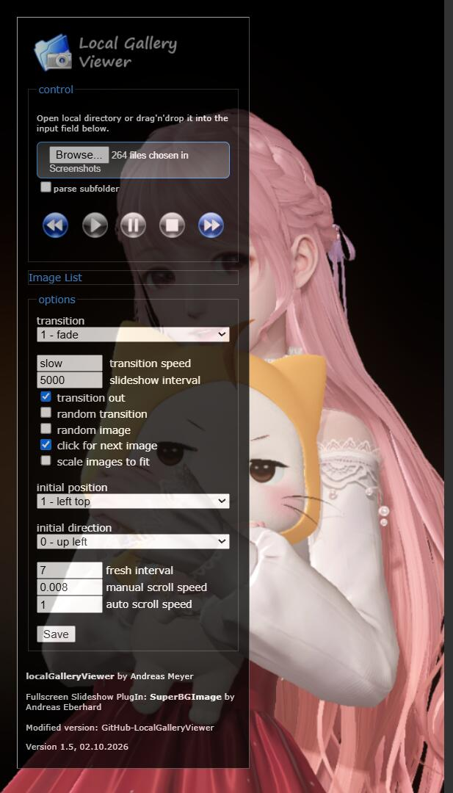
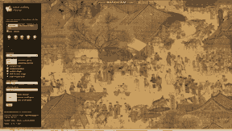

# LocalGalleryViewer

---
Some personal customizations based on work originally by **Andreas Meyer (localGalleryViewerExtension)** and **Andreas Eberhard (SuperBGimage jQuery‑Plugin)**.  

Official Original Extension Store: [https://chrome.google.com/webstore/detail/localgalleryviewerextensi/opheklanmaieaeneebdohfpbjkhcgilk](https://chrome.google.com/webstore/detail/localgalleryviewerextensi/opheklanmaieaeneebdohfpbjkhcgilk)  

Please retain attribution for both original authors. Derivative modifications follow CC‑BY‑3.0 Unported. Use at your own risk.  


---  
## Interface Preview / 界面预览

  
  
  
  
  
  

---

**Licensed under CC\-BY\-3\.0 Unported**

> \- Deeply modified from localGalleryViewerExtension 1\.4  
> \- Adopts browser File System Access API for direct local file movement operations  
> \- Derivative modifications are licensed under Creative Commons Attribution 3.0 (CC‑BY‑3.0) open source license; bundled third‑party libraries retain their respective licenses.
> 
> 

## Usage

### Extension Debug \& Launch

1\. Debug: Load unpacked extension in Chrome, open gallery\.html, select directory via control panel \(folder drag\-and\-drop supported\)

2\. Recommended startup parameter \(kiosk large screen mode\)

```Plain Text
chrome.exe --enable-easy-off-store-extension-install -kiosk chrome-extension://[EXTENSION_ID]/gallery.html
```

## New Features

### Scaling \& Transition Enhancement

Enhanced scalefit scaling mode: Auto zoom images with automatic continuous scrolling
\- scalefit=0: Disabled; fit the entire image to the viewport

\- scalefit=1: Semi\-transparent enabled; single\-direction scrolling to browse the full image

\- scalefit=2: Fully enabled; single\-direction scrolling \+ automatic reciprocating scrolling\. Supporting parameters: initial position, initial direction, refresh rate, horizontal and vertical scrolling speed \(Transition effect changed from old image fadeOut to new image fadeIn\)

### Image \& Interactive Operations

\- Left click: Pause / resume slideshow

\- Keyboard ← →: Previous / next file

\- Mouse wheel zoom: Zoom centered at mouse pointer

\- Cursor edge hovering triggers auto\-scroll; left\-click drag image supported

\- Middle click: Reset zoom and position

\- Right click: Disable auto\-scroll \(kiosk mode only\)

### Supported Media Formats

Image formats: png, bmp, jpeg, jpg, gif, svg, xbm, webp

Video formats: webm, mp4; slideshow interval will not be shorter than video duration

### Local file sorting via keyboard shortcuts \(0\-9 / DEL\)

0～9: Move current file to corresponding numeric subfolder in the current directory \(auto\-create folder if not exists\)

DEL: Move current file to`_TRASH_` recycle directory in root path \(no physical file deletion\)

Moved files will be grayed out with strikethrough, filtered automatically; prev/next navigation only traverses valid files

Requires browser support for File Access API

### Performance Optimization

\- WebWorker decoding for large images \(\>2MB\) to reduce main thread jank

\- Reusable canvas object pool to reduce repeated resource overhead

\- Screen wake lock to prevent automatic screen sleep

### Mobile Compatibility

Added mobile browser adaptation, tested and available on Android Kiwi Browser \(mobile file append mode fallback\)\.

## Project Changes

Upgraded extension manifest from V2 to Manifest V3 to adapt to modern browser specifications\.

## Known Issues

1\. Images with aspect ratio close to window size may jitter during auto\-scroll animation; pause or switch images to mitigate

2\. Modified scalefit configuration requires manual UI confirmation to take effect

3\. scalefit=2 auto\-scroll only supports `none/fade` transition; other transition types cause coordinate disorder

4\. Auto\-scroll consumes certain CPU resources; increase fpsinterval to reduce load \(fpsinterval should not be lower than screen refresh cycle\)

5\. Random mode previous image is also random instead of step back

6\. Screen tearing exists in animations due to vertical sync limitations; requires monitor and graphics card hardware VSync support  

7\. Modified control panel numeric settings after file loading still trigger file moving shortcuts — modify settings before loading files  

8\. EXIF rotation information will not be automatically processed \(inherited original legacy issue\)

9\. GIF animation may not fully play if animation duration exceeds slideshow interval \(unable to accurately obtain GIF duration, interval uses default value\)

10\. FileSystemAccess write permission restrictions may block folder creation and file moving in partial environments; only console warning without popup prompt

11\. parentDirHandle will not auto\-update after file moving; manual directory rescanning required to refresh handles

12\. Duplicate filenames in `_TRASH_` directory will cause moving failure \(browser API does not support automatic overwriting/renaming\)

13\. Limited by system and browser rules, mobile browsers only support mobile mode, desktop mode is unavailable; directory selection is invalid, fallback to append\-only multi\-file selection  
  
 
---
# LocalGalleryViewer

# 中文说明

本项目基于 **Andreas Meyer（localGalleryViewerExtension）**、**Andreas Eberhard（SuperBGimage jQuery插件）** 的作品深度二次定制开发，保留原版核心能力并新增大量交互、性能、适配功能。  

原官方扩展商店地址：[https://chrome.google.com/webstore/detail/localgalleryviewerextensi/opheklanmaieaeneebdohfpbjkhcgilk](https://chrome.google.com/webstore/detail/localgalleryviewerextensi/opheklanmaieaeneebdohfpbjkhcgilk)  

衍生修改部分遵循 **CC‑BY‑3.0 知识共享署名开源协议**，附带第三方组件保留自身许可证；开源使用请保留两位原作者出处与版权声明，违规使用后果自负。  

> \- 基于 localGalleryViewerExtension 1.4 原版深度迭代修改  
> \- 依托浏览器 File System Access API，实现本地图片/视频快捷键分拣、移动等本地文件操作  
> \- 衍生修改部分遵循 CC‑BY‑3.0 开源规范，可合规二次修改与分发（需遵守署名要求，第三方组件除外） 


## 使用方法

### 扩展本体

1\. 调试：chrome加载已解压扩展，打开gallery\.html，control面板选择目录（支持拖拽文件夹）

2\. 推荐启动参数（kiosk大屏模式）

```Plain Text
chrome.exe --enable-easy-off-store-extension-install -kiosk chrome-extension:// 扩展 ID/gallery.html
```

## 新增特性

### 缩放与转场优化

scalefit增强：自动放大图片并自动滚动

\- scalefit=0：不勾选；适配视图完整展示整张图

\- scalefit=1：半透明勾选；单方向滚动即可浏览全图

\- scalefit=2：完全勾选；单方向滚动\+自动往复滚动；配套参数：初始位置、初始方向、刷新率、水平/垂直滚动速率（transition fade由旧图fadeOut改为新图fadeIn）

### 鼠标与键盘交互

\- 鼠标左键单击：暂停/继续幻灯片

\- 键盘 ← →：上一张、下一张

\- 鼠标滚轮缩放：以鼠标点为缩放中心

\- 鼠标移至屏幕边缘触发滚动；支持左键拖拽图片

\- 鼠标中键：重置缩放与位置

\- 右键：取消自动滚动（仅kiosk模式下生效）

### 支持媒体格式

支持图片：png、bmp、jpeg、jpg、gif、svg、xbm、webp

支持视频：webm、mp4；幻灯片间隔时长不低于视频本身时长

### 本地文件按快捷键分拣（键盘0‑9 / DEL）

0～9：将图片移动到**该图片所在目录下**对应的数字子文件夹；子文件夹不存在会自动创建

DEL：将图片移动到**打开的根目录下 \_TRASH\_ 回收站目录；不会物理删除文件**

已移动图片缩略图置灰\+删除线标记、过滤，上下一张仅遍历有效图片

浏览器版本需支持File Access API

### 性能优化

\- WebWorker 大图（2MB以上）预解码，减轻主线程卡顿

\- canvas对象池复用，减少重复开销

\- 防休眠熄屏

### 移动端适配

新增移动端浏览器兼容适配，已在安卓 Kiwi Browser 自测可用，移动端自动降级为文件追加模式，适配触屏操作逻辑。

## 项目迭代变更

完成扩展清单升级，从 Manifest V2 迭代至 V3，适配现代浏览器最新运行规范。

## 已知问题

1\. 图片宽高比接近窗口时，自动滚动动画可能会鬼畜抖动；请暂停或切图

2\. 修改配置后scalefit状态UI需要手动确认

3\. scalefit=2自动滚动仅支持transition none/fade，其余转场会坐标错乱

4\. 自动滚动有一定CPU开销，调高fpsinterval可降低负载（fpsinterval应不低于屏幕刷新周期）

5\. 随机模式下上一张图片也是随机，并非后退

6\. 垂直同步问题，动画中画面撕裂；需显示器、显卡支持并开启硬件垂直同步

7\. 加载文件后控件输入框修改数字，按键仍然会触发文件移动——请在加载文件前修改设置

8\. EXIF旋转（多为移动设备拍摄）不会自动处理，继承原版遗留问题

9\. gif等动图动画时长超幻灯片间隔时动画播放不全，因其时长难以获取，幻灯片间隔时间只能保持默认不变

10\. FileSystemAccess写权限限制；部分环境无法新建文件夹、移动文件，按键仅控制台警告，无弹窗报错

11\. 移动后内存列表不会自动更新parentDirHandle；需要重新扫描目录刷新句柄

12\. \_TRASH\_目录存在同名文件移动会报错，浏览器API不会自动重命名覆盖

13\. 受系统和浏览器限制，移动端浏览器浏览模式只支持手机版/移动版，不支持电脑版，无法选择目录，只能退而求其次，多选文件（追加）


---

## License / 开源协议

Derivative code (modifications based on localGalleryViewerExtension & SuperBGimage):  
‑ localGalleryViewerExtension, Copyright Andreas Meyer  
‑ SuperBGimage jQuery‑Plugin, Copyright (c) 2009 Andreas Eberhard  
‑ Further modifications Copyright (c) 2026 szfzafa

Derivative modifications are licensed under **CC‑BY‑3.0 Unported**.
Any secondary modification and redistribution must retain attribution for all original authors.

Bundled third‑party libraries keep their original licenses:  
‑ jQuery: MIT License  
‑ jscolor.js: GNU Lesser General Public License v2.1  

> Note: Portions of source code developed with AI assistance, copyright remains with szfzafa.

衍生代码（基于 localGalleryViewerExtension 与 SuperBGimage 的修改部分）：  
‑ localGalleryViewerExtension，著作权归 Andreas Meyer  
‑ SuperBGimage jQuery插件，Copyright (c) 2009 Andreas Eberhard  
‑ 2026进一步修改版本著作权归 szfzafa

衍生修改部分遵循 **CC‑BY‑3.0 知识共享署名3.0通用协议**。
进行二次修改、重新分发，必须完整保留全部原作者署名信息。

项目附带第三方组件沿用其原有许可证：
‑ jQuery：MIT 许可证
‑ jscolor.js：GNU Lesser General Public License v2.1

> 注：部分源代码在AI辅助下完成开发，著作权归 szfzafa 所有。

Full license text: <https://creativecommons.org/licenses/by/3.0/>  
完整协议文本：<https://creativecommons.org/licenses/by/3.0/>
